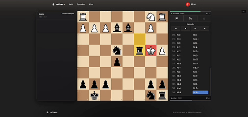
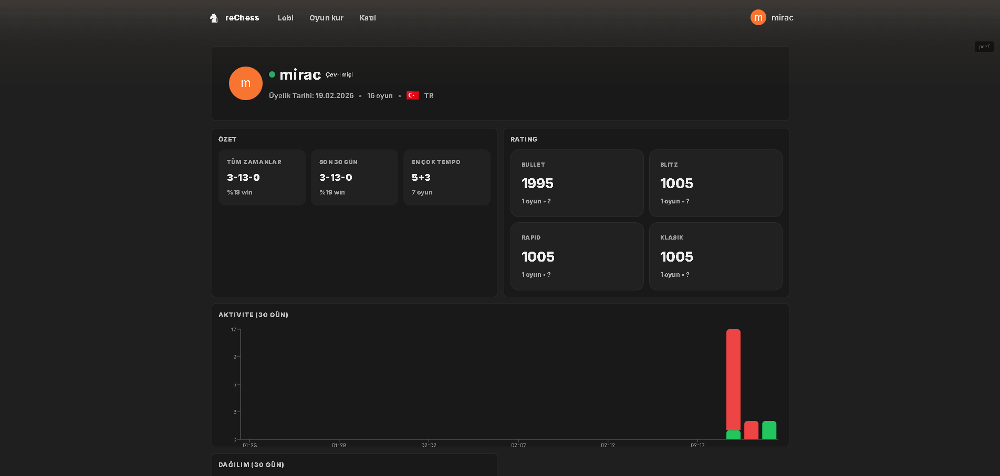
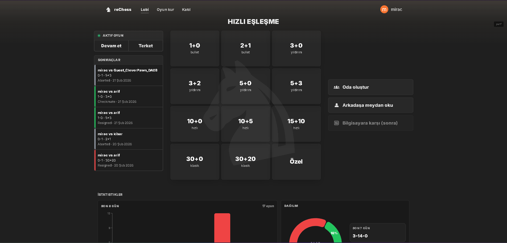

# ♟️ reChess

reChess is a real-time online chess platform with rated matchmaking, time controls, and persistent game history.

The project focuses on deterministic game state management, real-time synchronization, and a structured rating system based on Glicko-2.

---

## Demo

### Quick Match & Real-Time Gameplay

- Player joins the matchmaking queue  
- An opponent is found  
- The game starts instantly  
- Moves are synchronized in real time  


---

### Game Finish (Checkmate)

- Final move sequence  
- Checkmate  
- Game state finalized  
- Ratings updated  



---

## Interface

### Profile & Statistics

- User information  
- Online presence indicator  
- Rating per time control  
- 30-day activity graph  



---

### Lobby & Time Controls

- Bullet / Blitz / Rapid / Classical modes  
- Active game indicator  
- Recent matches list  
- Custom room creation  



---

## Core Features

- Real-time gameplay (Socket.IO)
- Redis-based game state management
- Time control with increment support
- Rated matchmaking
- Glicko-2 rating system
- Game history storage (PGN + moves)
- Reconnect support
- Disconnect timeout win claim
- Draw offer / accept / decline
- Private room (join code)

---

## Architecture

Backend stack:

- Node.js
- Express
- Socket.IO
- Redis
- MongoDB
- chess.js

Game state is stored in Redis.  
A periodic tick mechanism updates clocks and checks for timeout conditions.

When a game finishes:

1. The result is marked in Redis
2. Ratings are recalculated (Glicko-2)
3. The result is persisted in MongoDB

---

## Time Control System

Speed category is derived from:

- Initial time
- Increment

Supported categories:

- Bullet
- Blitz
- Rapid
- Classical

Each speed has an independent rating.

---

## Rating System

- Glicko-2 implementation
- Separate rating per speed
- Provisional player support
- Automatic rating difference calculation

---

## Game Result Persistence

Each finished game stores:

- Winner
- Finish reason (checkmate, timeout, resign, draw, disconnect, etc.)
- Final FEN
- PGN
- Move history
- Time data
- Rated / unrated flag

All results are stored in MongoDB.

---

## Real-Time Events

Main WebSocket events:

- queue:join
- queue:matched
- game:create
- game:join
- game:move
- game:ended
- game:draw_offer
- game:resign
- game:claim_win
- game:request_sync

Reconnect automatically restores the current game state.

---

## Installation

### Backend

```bash
npm install
npm run socket
```

### Frontend

```bash
npm install
npm run dev
```

### Required Services

- Redis
- MongoDB

---

## Project Purpose

reChess demonstrates how to implement a real-time rated chess system end-to-end.

Focus areas:

- Real-time synchronization
- Deterministic game lifecycle
- Rating algorithm integration
- Redis-based ephemeral state handling
- Persistent result storage
